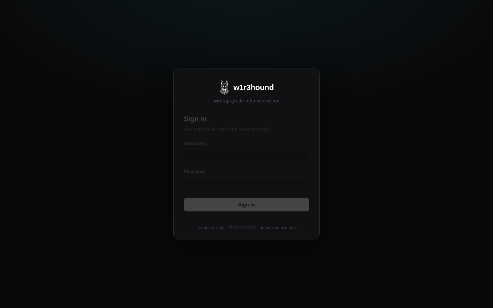
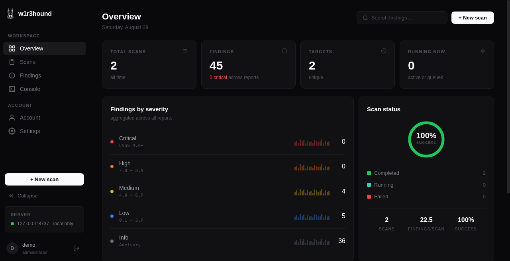
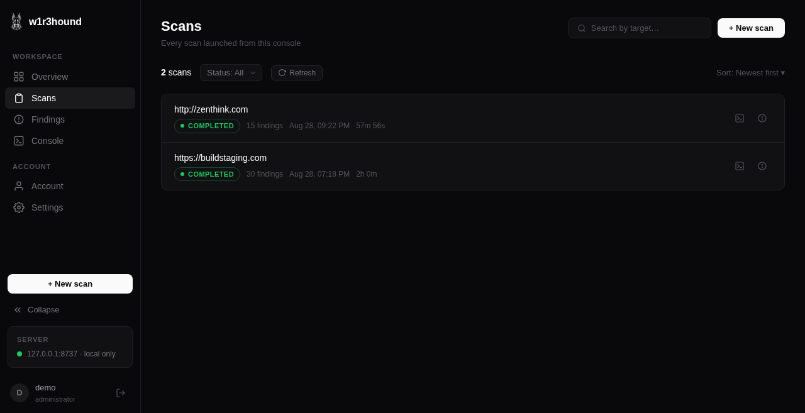

# w1r3hound — wiretap-grade offensive recon

```⠀⠀⠀⠀⠀⠀⠀⠀⠀⠀⠀⠀⠀⠀⠀⠀⠀⠀⠀⠀⠀⠀⠀⠀⠀⠀⠀⠀⠀⠀⠀⠀⠀⠀⠀⠀⠀⠀⠀⠀⠀⠀⠀⠀⠀⠀⠀⠀⠀⠀⠀

██╗    ██╗ ██╗██████╗ ██████╗ ██╗  ██╗ ██████╗ ██╗   ██╗███╗   ██╗██████╗
██║    ██║███║██╔══██╗╚════██╗██║  ██║██╔═══██╗██║   ██║████╗  ██║██╔══██╗
██║ █╗ ██║╚██║██████╔╝ █████╔╝███████║██║   ██║██║   ██║██╔██╗ ██║██║  ██║
██║███╗██║ ██║██╔══██╗ ╚═══██╗██╔══██║██║   ██║██║   ██║██║╚██╗██║██║  ██║
╚███╔███╔╝ ██║██║  ██║██████╔╝██║  ██║╚██████╔╝╚██████╔╝██║ ╚████║██████╔╝
 ╚══╝╚══╝  ╚═╝╚═╝  ╚═╝╚═════╝ ╚═╝  ╚═╝ ╚═════╝  ╚═════╝ ╚═╝  ╚═══╝╚═════╝

   [ wiretap-grade offensive recon ]
   ─────────────────────────────────────
   w1r3hound v2.0.0 · OWASP WSTG · BBP · CTF
```

> *"Privacy is a lie. Security is an illusion. The only thing that's real is the data.
— Dusan Nemec"*

**w1r3hound** is a single-binary offensive reconnaissance framework for
bug bounty hunting, penetration testing, and CTF competitions. It implements the full OWASP WSTG v4.2
Information Gathering phase and extends it with coverage gaps that
most scanners miss: ASN-to-CIDR expansion, subfinder-style
permutations, JS endpoint extraction, cloud-bucket probing, SaaS
enumeration, and HTTP-signature subdomain takeover fingerprinting.

Zero dependencies. Single binary. Cross-platform. One scan to profile
everything.

## Installation

```bash
git clone https://github.com/R4Wbytes/w1r3hound.git
cd w1r3hound
go build -o w1r3hound .
```

### Cross-compile

```bash
GOOS=linux   GOARCH=amd64 go build -o w1r3hound-linux .
GOOS=darwin  GOARCH=arm64 go build -o w1r3hound-mac .
GOOS=windows GOARCH=amd64 go build -o w1r3hound.exe .
```

## Usage

```bash
# Profile everything
w1r3hound -t example.com

# Save the breach report
w1r3hound -t example.com -o breach_report

# Passive signals only — no active probing
w1r3hound -t example.com -passive

# Select specific protocols
w1r3hound -t example.com -m fingerprinter,sentry,deepdive

# Aggressive CTF scan
w1r3hound -t 10.10.10.100 -p full -c 100 -v

# Bug bounty with custom subdomain list
w1r3hound -t target.com -w /path/to/subdomains.txt -o bb_report
```

### Options

```
  -t, -target        Target to profile (required)
  -o, -output        Output file base (generates .json + .md)
  -m, -protocols     Comma-separated protocols (default: all)
  -c, -concurrency   Parallel connections per protocol (default: 20)
  -p, -ports         Port range: top100, 1-1024, full (default: top100)
  -w, -wordlist      Path to subdomain wordlist file
  -dir-wordlist      Path to a directory/file bruteforce wordlist (default: embedded list)
  -dir-ext           Comma-separated extensions appended to each dirbrute word, e.g. .bak,.php,.zip,~
  -resolver          Custom DNS resolver, e.g. 1.1.1.1 or 8.8.8.8:53 (default: system)
  -resolvers         Path to a resolver list — opts subdomain brute-force/permutation into the
                     raw-UDP DNS engine (rotates across resolvers, -rate governs DNS too)
  -H, -header        Custom HTTP header in 'Name: value' format (repeatable)
  -skip-tls-verify   Skip TLS certificate verification (default: true)
  -block-private-egress  Refuse dials to loopback/private/link-local IPs — opt-in SSRF guard (default: false)
  -wayback-limit     Max URLs to pull from the Wayback CDX API (default: 5000)
  -crawl-pages       Max pages for the crawler (default: 100)
  -js-files          Max JavaScript files to analyse (default: 50)
  -v, -verbose       Debug output
  -passive           Passive mode (no traffic to target)
  -rate              Max requests/sec (0 = unlimited)
  -timeout           Per-request timeout (default: 10s)
  -ua                Custom User-Agent
```

## Scan Protocols

The framework ships with **21 modules** grouped in 5 categories (the 21st,
`endprobe`, is an unauthenticated-access probe over JS-discovered endpoints).
The themed aliases use a wiretap/surveillance vocabulary — both
themed names and the plain internal names are accepted on the
command line.

### Passive OSINT (safe — no traffic to target)

| Alias | Internal | What it does | WSTG |
|-------|----------|-------------|------|
| `recon` | whois | WHOIS/RDAP domain intelligence | INFO-01 |
| `traceroute` | asnmap | ASN → CIDR range discovery via BGP | INFO-04 |
| `passivewatch` | passivesrc | Passive subdomains (CT logs, 6 sources) | INFO-01 |

### DNS & Subdomains

| Alias | Internal | What it does | WSTG |
|-------|----------|-------------|------|
| `fingerprinter` | dns | DNS enum, real AXFR, SRV, SPF/DMARC, takeover | INFO-04, CONF-10 |
| `archaeology` | wayback | Wayback Machine URL & parameter harvesting | INFO-01 |
| `diversify` | permute | Subdomain permutation & resolution | INFO-04 |

### Live Detection & Fingerprinting

| Alias | Internal | What it does | WSTG |
|-------|----------|-------------|------|
| `heartbeat` | httprobe | HTTP probe + favicon hash (Shodan pivoting) | INFO-04 |
| `probescan` | webserver | Server fingerprint, TLS cert, HTTP methods | INFO-02, CONF-06 |
| `metadata` | metafiles | robots.txt, sitemap, security.txt, .well-known | INFO-03, CONF-08 |
| `sentry` | headers | Security headers audit, tech fingerprinting | INFO-08, CONF-07 |
| `deepdive` | content | HTML comments, JS secrets, source maps, leaks | INFO-05 |

### Attack Surface

| Alias | Internal | What it does | WSTG |
|-------|----------|-------------|------|
| `portscan` | portscan | TCP port scan with service ID & banner grab | INFO-04, CONF-01 |
| `corstrace` | cors | CORS misconfiguration testing | CLNT-07 |
| `cloudsniff` | cloud | S3/Azure/GCS/Firebase/DigitalOcean buckets | CONF-11 |
| `bruteforce` | dirbrute | Hidden paths, admin panels, backups, configs | CONF-03/04/05 |
| `apiscan` | apiscan | GraphQL introspection, Swagger/OpenAPI, REST, WS | INFO-06 |
| `saasenum` | saasenum | SaaS enum (Zendesk/JIRA/Okta/Salesforce +15 more, 19 total) | INFO-10 |
| `crawler` | crawler | Web crawl for forms, params, entry points | INFO-06/07 |

### Deep Analysis

| Alias | Internal | What it does | WSTG |
|-------|----------|-------------|------|
| `jsdeep` | jsdeep | JS endpoint extraction (LinkFinder style) | INFO-05 |
| `takeover` | takeover | Subdomain takeover via HTTP fingerprints (37 services) | CONF-10 |

### Beyond WSTG

- **Certificate Transparency** — subdomain discovery from crt.sh + 5 more passive sources
- **ASN/CIDR mapping** — finds IP space DNS enumeration never reaches (BGPView)
- **Favicon hashing** — MurmurHash3 (Shodan-compatible) for `http.favicon.hash:` pivoting
- **Real AXFR** — raw TCP/53 zone transfer, no external dependencies
- **SRV enumeration** — 30+ service prefixes (SIP, LDAP, Kerberos, XMPP)
- **GraphQL introspection** — detects exposed schemas
- **API doc discovery** — Swagger/OpenAPI/Postman across 20+ paths
- **SaaS enumeration** — 19 third-party platforms outside the security review cycle
- **JS endpoint extraction** — LinkFinder-style with cloud URL & secret detection
- **HTTP-signature takeover** — 37 service fingerprints (beyond NXDOMAIN-only)
- **Subdomain permutation** — dev/staging/prod variations with wildcard filtering
- **Data feedback pipeline** — modules feed subdomains/JS/endpoints to each other
- **26 secret patterns** — AWS keys, Stripe, GitHub tokens, JWT, DB strings
- **CORS exploitation testing** — origin reflection, null origin, wildcard + credentials
- **Smart soft-404 detection** — 4-strategy filter + cluster analysis
- **CDN/WAF awareness** — detects Cloudflare and flags CDN ports
- **Apex-aware findings** — subdomains inherit DMARC/SPF from apex (RFC 7489 §6.3)
- **Source coverage reporting** — `sources_attempted` / `_failed` / `_successful` per scan

## Output

**JSON** (`w1r3hound_target_timestamp.json`) — machine-readable, pipeline-friendly, every finding with raw data.

**Markdown** (`w1r3hound_target_timestamp.md`) — human-readable breach report grouped by severity with WSTG IDs.

### Severity Scale

| Level | Meaning |
|-------|---------|
| CRITICAL | Exposed configs (.env, .git), public cloud buckets |
| HIGH | Subdomain takeover, CORS with credentials, dangerous services |
| MEDIUM | Missing security headers, TRACE method, source maps |
| LOW | Version leak, internal IPs, informational exposure |
| INFO | Scan data, tech stack, crawl results |

## Web GUI

A localhost-only **dashboard console** lives in `webui/` (Go standard library
only — still zero third-party dependencies, no external CDNs or fonts). It
drives the compiled CLI as a subprocess, streams scan output live over
Server-Sent Events, queues scans through a 2-worker pool, and renders the
JSON/Markdown reports in the browser. The frontend is a single-page app with a
dark, card-based dashboard design.







```bash
# one command: builds the CLI if needed, builds the GUI, serves it and
# opens the browser at http://127.0.0.1:8737
./webui/run.sh
```

Manual equivalent:

```bash
go build -o w1r3hound .
go build -o webui/w1r3hound-webui ./webui
./webui/w1r3hound-webui        # listens on 127.0.0.1:8737 only
```

### Pages

- **Overview** — aggregate stats (scans, findings, targets, running now), a
  findings-by-severity breakdown, a scan-status donut, and recent scans, all
  derived from the live scan list.
- **Scans** — real scan history with status, findings count, timing, and
  per-scan actions (open console, view findings, cancel).
- **Findings** — vulnerabilities parsed from each scan's `report.json`, shown
  in a severity-styled table with a slide-in detail panel (module, WSTG ID,
  description, raw data). Filter by severity/triage/text, tag a local triage
  status per finding, and export the report to CSV.
- **Console** — the scan launcher and live terminal. The **New scan** modal
  exposes the CLI options the backend validates (`-t`, `-m` with all 21
  modules grouped by category and all/none/passive presets, `-c`, `-p`, `-w`,
  `-rate`, `-timeout`, `-ua`, `-o`, `-passive`, `-v`) plus an **Advanced
  options** section at full CLI parity (`-dir-wordlist`, `-dir-ext`, `-H`
  custom headers, `-skip-tls-verify`, `-block-private-egress`, `-resolver`,
  `-resolvers`, `-wayback-limit`, `-crawl-pages`, `-js-files`), with passive
  mode on by default and a mandatory authorization checkbox. Engine output
  streams line by line over SSE with severity coloring; running scans are
  cancellable and each scan gets a tab.
- **Account** — the signed-in user's profile, a change-password form, sign-out,
  and (for administrators) user management: create/delete users, reset
  passwords, and unlock locked-out accounts.
- **Settings** — legacy open-mode auth token, the authorized-use notice,
  report-storage info, and a control to clear local triage state.

Reports and captured logs are written under `webui/results/`; custom subdomain
wordlists must be placed in `webui/wordlists/` (paths outside it are rejected).

### Login panel

The GUI ships with an optional account-based login panel (standard library
only — no new dependencies). It is **off by default** so the zero-config
loopback workflow keeps working; the first account you create turns it on for
everyone.

- **First-run setup.** With no accounts, the login screen offers a one-time
  "create administrator" form (or use the **Account → Set up login** button).
  No default credentials ship with the tool.
- **Roles.** `admin` accounts manage users; `user` accounts run scans and
  manage their own password. Admin-provisioned passwords must be changed on
  first sign-in — enforced **server-side**: such an account can only reach the
  password-change endpoints until it rotates. The last administrator cannot be
  deleted.
- **Passwords.** Stored only as salted **PBKDF2-HMAC-SHA256** hashes
  (600k iterations, per-user 128-bit salt) in `webui/auth/users.json`
  (`0600`, in a `0700` dir). Policy favours length: ≥ 12 characters, a small
  common-password deny-list, and the username is rejected as a password.
- **Sessions.** 256-bit CSPRNG tokens in an `HttpOnly`, `SameSite=Strict`
  cookie; only the SHA-256 of each token is kept server-side. Idle (30 min) and
  absolute (12 h) timeouts apply. Changing a password revokes every other
  session.
- **Brute-force resistance.** Constant-time verification (with a dummy hash on
  unknown usernames to prevent enumeration), plus per-account lockout after 10
  failed attempts for 15 minutes. A process-wide pre-auth throttle (concurrency
  semaphore + token bucket) caps the PBKDF2 CPU an unauthenticated caller can
  spend on `login`/`setup`, shedding floods with `429`.
- **CSRF.** The existing origin/`Sec-Fetch-Site` guard is backed by a
  per-session `X-CSRF-Token` synchroniser on every state-changing request.

```bash
# Force the gate before any admin exists (refuse the API until setup):
W1R3HOUND_AUTH=required ./webui/run.sh

# Headless/automated bootstrap of the first admin (env is never persisted):
W1R3HOUND_ADMIN_USER=admin W1R3HOUND_ADMIN_PASS='a-long-unique-passphrase' ./webui/run.sh
```

Once accounts exist, session auth protects **every** API route (including the
read/report endpoints) and the legacy `W1R3HOUND_UI_TOKEN` is no longer used.

Hardening: the server binds to `127.0.0.1` only, rejects cross-origin and
DNS-rebinding requests, ships a strict Content-Security-Policy (self-hosted
assets, no inline scripts) alongside cross-origin isolation headers
(COOP/CORP/COEP) and a restrictive `Permissions-Policy`, validates every field
against allow-lists (modules, port ranges, numeric bounds, hostname/IP/CIDR/URL
targets), never invokes a shell, and supports the account-based **login panel**
above. Without accounts it can still require a legacy shared token on the
scan/cancel endpoints:

```bash
W1R3HOUND_UI_TOKEN=secret ./webui/run.sh   # then enter the token in Settings
```

The same rules as the CLI apply: authorized targets only.

## Quick Playbook

### Bug Bounty

```bash
w1r3hound -t target.com -w subdomains-top1million.txt -o loot
w1r3hound -t target.com -m fingerprinter,archaeology,recon -passive   # passive first
w1r3hound -t target.com -m deepdive,sentry,bruteforce                   # then active
```

### Pentest

```bash
w1r3hound -t client.com -p full -c 50 -v -o pentest_recon
w1r3hound -t 192.168.1.0/24 -m portscan,probescan -p 1-65535
```

### CTF

```bash
w1r3hound -t 10.10.10.100 -p full -c 100 -v
w1r3hound -t http://challenge.ctf:31337 -m probescan,deepdive,bruteforce,crawler
```

## Architecture

```
w1r3hound/
├── main.go                          # CLI, protocol router, banner
├── go.mod                           # module github.com/R4Wbytes/w1r3hound
├── internal/
│   ├── core/
│   │   └── core.go                  # Config, HTTP client, rate limiter, logger
│   ├── modules/
│   │   ├── passive.go               # PASSIVESRC — CT logs, passive DNS (6 sources)
│   │   ├── asn.go                   # ASNMAP — ASN/CIDR BGP discovery
│   │   ├── dns.go                   # FINGERPRINTER — subdomain enum, zone transfer
│   │   ├── dnsextra.go              # AXFR utils, DNS message builder
│   │   ├── dnsengine.go             # Raw-UDP DNS brute-force engine
│   │   ├── takeover.go              # TAKEOVER + PERMUTE — takeover fingerprint, subdomain permute
│   │   ├── discovery.go             # ARCHAEOLOGY, CORSTRACE, CLOUDSNIFF, BRUTEFORCE
│   │   ├── httprobe.go              # HEARTBEAT — HTTP probe + favicon hash
│   │   ├── webserver.go             # PROBESCAN — server fingerprint, TLS
│   │   ├── metafiles.go             # METADATA — robots.txt, sitemap, security.txt
│   │   ├── headers.go               # SENTRY — security headers, tech detection
│   │   ├── content.go               # DEEPDIVE — HTML/JS analysis, secret scan
│   │   ├── jsanalysis.go            # JSDEEP — LinkFinder-style JS endpoint extraction
│   │   ├── api.go                   # APISCAN — GraphQL/Swagger/OpenAPI/REST/WS
│   │   ├── saas.go                  # SAASENUM — 19 third-party platforms
│   │   ├── crawler.go               # CRAWLER + RECON — web crawl, WHOIS/RDAP
│   │   ├── portscan.go              # PORTSCAN — TCP scanner
│   │   ├── surface.go               # Attack-surface summary aggregator
│   │   ├── psl.go                   # Public Suffix List (Mozilla PSL)
│   │   └── helpers.go               # Shared utils
│   └── report/
│       └── report.go                # JSON + Markdown report gen
├── webui/                           # localhost-only dashboard console
│   ├── main.go                      # HTTP server, routes, CSP/origin guard
│   ├── auth.go                      # login panel: users, sessions, lockout, RBAC
│   ├── password.go                  # PBKDF2-HMAC-SHA256 hashing + policy
│   ├── jobs.go                      # scan queue, worker pool, SSE broadcast
│   ├── validate.go                  # module catalog + request validation
│   ├── run.sh                       # build CLI + GUI and serve on :8737
│   ├── auth/                        # user store (users.json, 0600) — runtime
│   ├── results/                     # generated reports & logs (runtime)
│   ├── wordlists/                   # user-supplied wordlists (runtime)
│   └── static/                      # single-page dashboard UI
│       ├── index.html               # sidebar SPA shell
│       ├── css/styles.css           # dashboard design system
│       └── js/
│           ├── api.js               # backend client + helpers
│           └── app.js               # SPA controller (all pages)
├── LICENSE
└── README.md
```

## Known Limitations

- No public-suffix (eTLD+1) scoping — pointing it at a subdomain scopes
  passive sources to that subdomain only, missing the apex and siblings.
- crt.sh/Wayback responses are capped at 10 MB, so very large CT logs get
  truncated.
- Only the root target is actively fingerprinted/secret-scanned; discovered
  subdomains are probed for liveness but not deep-scanned.
- The crawler doesn't preserve query parameters from `<a href>` links.
- No deduplication across multiple `w1r3hound` runs against the same target
  (each run produces its own `w1r3hound_target_timestamp.{json,md}` pair).

## Legal

This tool is for authorized security testing, bug bounty programs, CTF
competitions, and educational purposes only. Always have explicit
permission before profiling any target. Unauthorized access may violate
laws in your jurisdiction.

## License

MIT License
