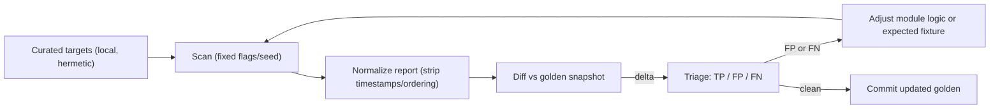

# Detection Accuracy: False-Positive / False-Negative Corrections

Recon tools live or die by signal quality. A false positive (FP) wastes a
hunter's time and erodes trust; a false negative (FN) misses real exposure. This
document defines how to measure and improve w1r3hound's accuracy, module by
module, without regressing.

## 1. Where we are

The engine already has an accuracy history — the git log shows "audit round"
work (rounds 8-12) themed around **scope-safe correlation and accuracy**:
non-routable-domain FP reduction, scheme auto-detection, severity tuning,
SPA HTTP-method fallback, portscan service fingerprinting from HTTP banners, and
a sensitive-endpoint authorization probe. These are backed by accuracy-oriented
tests already in the tree:

- `internal/modules/apex_normalize_test.go` — apex vs subdomain normalization.
- `internal/modules/content_scope_test.go` — content/secret scope safety.
- `internal/modules/{headers,httprobe,webserver,metafiles,api,crawler,discovery}_audit_test.go`
- `internal/modules/audit_new_test.go`, `audit_fixes_test.go` — regression pins.

This doc builds a **repeatable corpus + golden-snapshot** process on top of that.

## 2. Methodology

### 2.1 Curated corpus (hermetic — run locally)
- **Known-vulnerable apps (positive control):** OWASP Juice Shop, DVWA, bWAPP,
  WebGoat — run in local containers on loopback. Each has a documented set of
  expected exposures (e.g. Juice Shop `/ftp` directory listing, `/api-docs`).
- **Benign/hardened site (negative control):** a locally served static site with
  correct security headers, no secrets, no open dirs — expect **zero** medium+
  findings. This is the primary FP tripwire.
- **Synthetic loopback fixtures:** small handcrafted servers (like the audit's
  `/tmp/lab`) that emit one exact condition each (a specific missing header, a
  planted fake secret, a soft-404 pattern, a takeover-style CNAME body) to pin a
  single detector.
- **Non-routable / edge inputs:** `127.0.0.1`, RFC1918, a non-routable domain,
  an IDN/punycode host, a wildcard-DNS domain — to guard the scope-safety and
  non-routable handling from rounds 10/10c.

### 2.2 Golden snapshots
- Run each corpus target with fixed flags. Serialize the report JSON, then
  **normalize**: drop `started_at`/`ended_at`, sort `findings` by
  `(severity, module, title)`, and redact volatile data (IPs, hashes) where they
  aren't the assertion. Commit as `internal/modules/testdata/golden/<target>.json`.
- A test re-runs (or replays recorded HTTP) and diffs against the golden. Any
  delta fails and must be triaged as TP/FP/FN before the golden is updated.
- Prefer **replayed HTTP** (recorded fixtures) over live containers for CI
  determinism; keep the live-container run as a slower, manual/nightly job.

### 2.3 Triage workflow
For every diff line: label TP (correct, keep), FP (detector too loose → tighten
logic, add a negative fixture), or FN (missed → loosen/extend logic, add a
positive fixture). Record the decision in the PR. Severity disagreements are a
third bucket: recalibrate against the severity scale in the README.

## 3. Per-module FP/FN risk map

Prioritized by how often each detector is wrong in the wild.

| Module | FP risk | FN risk | What to pin with fixtures |
|--------|---------|---------|---------------------------|
| `content`/deepdive (secrets) | **High** — regexes match example/placeholder keys, base64-looking blobs | Real secrets behind minified JS | Positive: planted AWS/Stripe/JWT; Negative: `AKIAEXAMPLE`, doc snippets, high-entropy non-secrets |
| `discovery`/dirbrute | **High** — soft-404s counted as hits | Dirs behind auth/redirects | Soft-404 patterns (200-with-error-body, redirect-to-login), true hidden path, custom 404 |
| `takeover` | Medium — parking/generic 404 fingerprints | Services outside the 37 fingerprints | Dangling CNAME with a known body signature; a live CNAME (negative); an unknown provider (FN candidate) |
| `headers`/sentry | Medium — flagging headers on non-HTML/API responses; apex/subdomain SPF/DMARC inheritance | Missing header on a specific content type | HTML vs JSON responses; apex with DMARC, subdomain inheriting it |
| `corstrace`/cors | Medium — reflected origin without credentials treated as high | Preflight-only misconfig | ACAO reflection with/without `Allow-Credentials`; null origin; wildcard |
| `cloudsniff`/cloud | Medium — 403 vs 404 bucket-state confusion | Region/endpoint variants | Existing-private (403), missing (404), public-listing bucket mocks |
| `api`/apiscan | Medium — generic JSON mistaken for API doc/GraphQL | Non-standard doc paths | Real `/api-docs` swagger, GraphQL introspection on/off, decoy JSON |
| `portscan` | Medium — service ID from HTTP banners; filtered vs closed | Non-standard ports | Known-service banners; a filtered port; an HTTP banner-derived service |
| `webserver`/probescan | Medium — scheme detection, TLS parse, HTTP methods (TRACE), SPA fallback | Methods behind WAF | http-only, https-only, self-signed TLS, TRACE-allowed, SPA that 200s everything |
| `metafiles` | Low/Med — soft-404 on `.well-known`; scope-safe sitemap | Non-standard security.txt | robots with off-host sitemap (scope), valid security.txt with Expires |
| `passive`/`wayback`/`asn` | Low — but trusts 3rd-party volume/CIDRs (`C-12`); non-routable handling | CT-log truncation caps | Non-routable domain (skip passive), capped CT response, decoy CIDR |
| `dns`/`permute` | Low — wildcard DNS FP | Rare record types | Wildcard-DNS domain, AXFR-allowed vs refused, SRV set |
| `jsdeep`/`endprobe` | Low/Med — relative-path endpoints; unauth-access probe severity | Endpoints in sourcemaps | JS with absolute+relative endpoints; a 200 vs 401 sensitive endpoint |
| `saas` | Low — generic responses matched to a platform | New platforms | One true platform fingerprint + a look-alike decoy |

## 4. Severity calibration

Re-check that each finding's severity matches the README scale (CRITICAL =
exposed configs/public buckets; HIGH = takeover/CORS-with-creds; MEDIUM =
missing headers/TRACE/sourcemaps; LOW = version/IP leak; INFO = scan data). The
audit-round history already tuned several; add assertions so severity can't
silently drift (golden snapshots capture `severity` per finding).

## 5. Scope-safety invariants (regression guards)

These are recurring FP sources; encode each as an explicit test:
- Subdomain-scoped scans must not attribute apex-only findings to the subdomain,
  and vice-versa (`apex_normalize_test.go` covers part of this).
- Non-routable / RFC1918 / non-resolving targets skip passive/OSINT that would
  be meaningless or externally noisy (rounds 10/10c).
- Off-scope URLs (robots `Sitemap:`, swagger `initURL`) are never fetched
  (`isSameDomainURL`; also the `C-1` security fix) — an accuracy *and* security
  invariant.

## 6. Deliverables (later phase)
- `internal/modules/testdata/golden/` snapshots + a `golden_test.go` runner.
- Recorded HTTP fixtures for the deterministic CI path.
- A short `CORPUS.md` describing how to stand up the local vulnerable apps.
- FP/FN triage notes captured per PR touching a detector.
