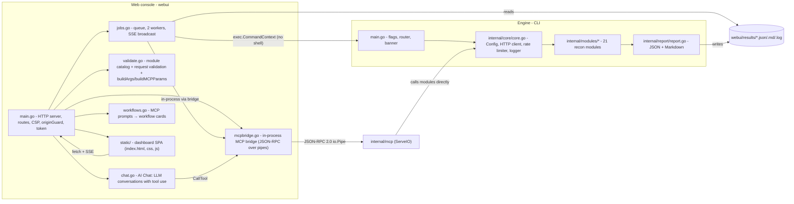
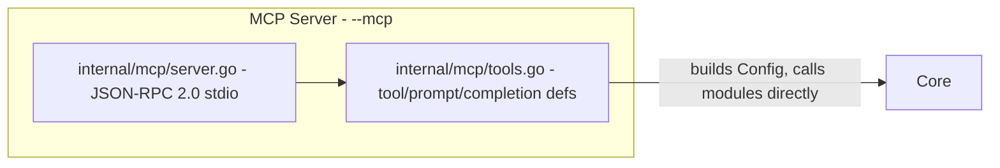

# Project State

A snapshot of what is currently built in `~/Desktop/w1r3hound/`, to anchor the
QA, security, and parity work. All references are `file:line` against the
canonical project.

## 1. Architecture

w1r3hound is a single-binary offensive-recon engine (the CLI) plus a
localhost-only web console that drives scans as subprocesses **or** in-process
via the MCP bridge.

The MCP server is a third entry point: `--mcp` starts a JSON-RPC 2.0 server
over stdio that exposes recon modules as MCP tools for AI agents. It calls the
engine in-process (no subprocess) with SSRF guard ON by default. Supports async
scan cancellation, progress notifications, prompts, completions, and structured
output (protocol version `2025-06-18`).

The webui now also embeds an **MCP bridge** (`mcpbridge.go`): an in-process
JSON-RPC 2.0 connection to the same MCP server via `io.Pipe`. This enables two
new paths: (1) MCP-sourced scans (`source: "mcp"`) that run without spawning a
subprocess, and (2) the **AI Chat** feature (`chat.go`) where an LLM calls
w1r3hound tools via the bridge. Workflow cards (`workflows.go`) surface MCP
prompts as one-click scan presets on the Overview page.

Key trust boundary: the browser talks only to the loopback Go server; the Go
server spawns the CLI with a validated `[]string` argv (never a shell) **or**
runs scans in-process via the MCP bridge (same validation). AI Chat makes
outbound HTTPS calls to the Anthropic API only — the API key is stored
server-side and never sent to the browser. The CLI, MCP server, and MCP bridge
are the only components that touch the network target.

## 2. Build & health

- Language/toolchain: Go, module `github.com/R4Wbytes/w1r3hound`, `go 1.22`
  language directive with a `toolchain go1.26.6` pin (go.mod); last built/tested
  with `go1.26.6` (govulncheck clean — clears the `go1.26.5` advisories, C-11).
- Zero third-party dependencies (standard library only), including the webui.
- As of the reskin handoff: `go vet ./...` clean, `go test ./...` all pass, and
  a live loopback scan smoke test (portscan of `127.0.0.1`) streamed over SSE
  and produced a valid report.
- Build entry points:
  - CLI: `go build -o w1r3hound .`
  - webui: `go build -o webui/w1r3hound-webui ./webui`
  - One-shot: `./webui/run.sh` (builds both, serves `http://127.0.0.1:8737`).
- Binaries are intentionally not committed to the canonical tree; `run.sh`
  rebuilds on demand.

## 3. Module inventory (21)

Themed alias / internal name / category (from `moduleCatalog` in
[webui/validate.go](../webui/validate.go) lines 27-53, mirroring `main.go`).
(`endprobe` now carries its own alias in the catalog, so all 21 modules are
addressable by an alias.)

- Passive OSINT: `recon`/whois, `traceroute`/asnmap, `passivewatch`/passivesrc
- DNS & Subdomains: `fingerprinter`/dns, `archaeology`/wayback, `diversify`/permute
- Live Detection & Fingerprinting: `heartbeat`/httprobe, `probescan`/webserver,
  `metadata`/metafiles, `sentry`/headers, `deepdive`/content
- Attack Surface: `portscan`, `corstrace`/cors, `cloudsniff`/cloud,
  `bruteforce`/dirbrute, `apiscan`, `saasenum`, `crawler`
- Deep Analysis: `jsdeep`, `endprobe` (internal only), `takeover`

Passive vs active is tracked per module by the `Active` flag; `-passive` skips
active modules.

## 4. Data model

- `core.Finding` ([internal/core/core.go](../internal/core/core.go) ~525):
  `module`, `wstg_id` (omitempty), `title`, `description` (omitempty),
  `severity`, `data` (omitempty, arbitrary).
- `core.ReconReport`: `target`, `started_at`, `ended_at`, `findings[]`.
- Severity constants (UPPERCASE): `CRITICAL`, `HIGH`, `MEDIUM`, `LOW`, `INFO`.
  The frontend normalizes these to lowercase CSS tokens in `js/api.js`.

## 5. webui API surface

Routes registered in [webui/main.go](../webui/main.go) (`s.handler()`, lines
~147-180):

Scan / report:
- `GET /` (embedded `static/`)
- `GET /api/modules`
- `GET /api/workflows`
- `POST /api/scan` (accepts `source: "mcp"` for bridge-backed scans)
- `GET /api/scans`, `GET /api/scans/{id}`
- `POST /api/scans/{id}/cancel`
- `GET /api/scans/{id}/events` (SSE; exempt from the CSP header)
- `GET /api/scans/{id}/log`
- `GET /api/scans/{id}/report.json`, `GET /api/scans/{id}/report.md`

Login panel (added with `auth.go`; gated by `authGate` when enabled):
- `GET /api/auth/status`, `POST /api/auth/setup`, `POST /api/auth/login`,
  `POST /api/auth/logout`, `GET /api/auth/me`, `POST /api/auth/change-password`
- Admin: `GET/POST /api/auth/users`, `DELETE /api/auth/users/{username}`,
  `POST /api/auth/users/{username}/reset`, `POST /api/auth/users/{username}/unlock`

AI Chat:
- `GET /api/chat/config`, `POST /api/chat/config` (admin-only: set API key/model)
- `GET /api/chat/conversations`, `POST /api/chat/conversations`
- `GET /api/chat/conversations/{id}`, `DELETE /api/chat/conversations/{id}`
- `POST /api/chat/conversations/{id}/message` (SSE streaming response)

When the login panel is enabled, `authGate` requires a session on **every**
`/api/*` route except `status`/`login`/`setup` (superseding the legacy
open-mode `W1R3HOUND_UI_TOKEN`, which only gates mutations).

Concurrency/limits: worker pool `numWorkers=2`, `queueCapacity=32`,
`maxLogLines=5000` ring buffer ([webui/jobs.go](../webui/jobs.go) lines 32-34).

## 6. Frontend (reskin)

Dashboard SPA under [webui/static/](../webui/static/):
- `index.html` — sidebar shell, 7 pages: Overview, Scans (`data-page="audits"`),
  Findings, Console, AI Chat, Account, Settings. (The New-scan modal now also
  carries the CLI-parity **Advanced options** section — see
  [CLI_PARITY.md](CLI_PARITY.md).) Overview includes workflow cards
  (MCP prompts as one-click scan presets). Scan list shows an MCP badge for
  bridge-sourced scans. Settings includes AI Chat configuration (API key,
  model, max tokens).
- `css/styles.css` — dark design system (source badges, workflow cards, chat
  layout, responsive breakpoints).
- `js/api.js` — backend client, severity normalization, SSE/log helpers,
  workflow and chat API endpoints.
- `js/app.js` — SPA controller (all pages, scan modal, detail panel, toasts,
  AI Chat with streaming SSE, workflow prefill).

Client-side state (browser `localStorage`): `w1r3hound_token` (auth token),
`w1r3hound_triage` (per-finding triage labels; UI-only, not persisted server-side).
CSP-safe: self-hosted assets, no inline `<script>`/`on*=` handlers; it does use
inline `style="..."` attributes (allowed by `style-src 'unsafe-inline'`).

## 7. Automated test coverage (current)

> **Updated 2026-09-16 (AI Chat + MCP bridge + workflows).** The tree now has
> **57 `_test.go` files, ~319 `Test` + 6 `Fuzz` + 5 `Benchmark` functions**
> spanning the engine, the webui, and the MCP server. New webui test files:
> `chat_test.go` (CRUD, config persistence, conversation ID validation),
> `mcpbridge_test.go` (bridge init, CallTool, Prompts, GetPrompt, invalid-target
> scan, Close), `workflows_test.go` (enrichment, defaults, filtering, edge cases).
> Plus a hermetic Playwright smoke under `webui/e2e/` and a CI workflow at
> `.github/workflows/ci.yml`. See §7a for the reconciled gaps.
>
> Previous update: 2026-09-16 (MCP server). Count was **40 `_test.go` files,
> ~274 `Test` + 3 `Fuzz` + 3 `Benchmark` functions**.
>
> Previous update: 2026-08-27 (QA rounds 13–18). Count was
> **38 `_test.go` files, ~183 `Test` + 3 `Fuzz` + 3 `Benchmark` functions**.

17 test files, ~97 `Test`/`Fuzz`/`Benchmark` functions, all under the engine:

- Root: `main_test.go` (2)
- `internal/core/core_test.go` (7)
- `internal/report/report_test.go` (2)
- `internal/modules/`: `modules_test.go` (14), `headers_audit_test.go` (10),
  `discovery_audit_test.go` (10), `audit_fixes_test.go` (10),
  `dnsengine_test.go` (10), `audit_new_test.go` (8), `metafiles_audit_test.go` (5),
  `httprobe_audit_test.go` (5), `crawler_audit_test.go` (3),
  `content_scope_test.go` (3), `api_audit_test.go` (3),
  `dnsengine_integration_test.go` (3), `webserver_audit_test.go` (1),
  `apex_normalize_test.go` (1)

### Coverage gaps (the important part)
- **`webui/` backend: 0 tests.** `main.go`, `jobs.go`, `validate.go` are
  untested — no coverage for `buildArgs` validation, `originGuard`, CSP/token,
  `confinedResultFile`, or the job queue/cancel/SSE lifecycle.
- **Frontend: 0 tests.** No unit or headless coverage of the SPA (findings
  mapping, SSE rendering, triage persistence, CSV export, CSP-clean load).
- No repository CI configuration is present (tests are run manually).

### 7a. Reconciled coverage status (2026-08-27)
The three gaps above are **closed**:
- **webui backend — done.** `validate_test.go` + `parity_test.go` (buildArgs
  argv-exact + parity/injection/confinement), `server_test.go` (originGuard,
  security headers, token, start-scan, SSE), `jobs_test.go` (queue/cancel/run
  lifecycle via `TestHelperProcess`), `auth_test.go` + `password_test.go` +
  `security_test.go` + `authz_battery_test.go` (login/RBAC/CSRF/lockout/session
  idle+absolute timeout/forced-mode), `isolation_test.go` (per-user F-16),
  `catalog_test.go`, `csp_hygiene_test.go`, `hardening_test.go` (F-17 forced
  password-change enforcement + F-18 pre-auth login throttle; see
  SECURITY_ASSESSMENT §9).
- **Frontend — done (light).** `csp_hygiene_test.go` guards the strict CSP;
  the Playwright smoke (`webui/e2e/`) covers CSP-clean load, seven-page nav,
  same-origin `/api/modules`, the authorized gate and the parity Advanced
  options. It runs a hermetic open-mode server (`serve-hermetic.sh`).
- **CI — present.** `.github/workflows/ci.yml` mirrors `make ci`
  (vet + gofmt + test-race + CSP) plus golden/fuzz/build/smoke and informational
  govulncheck/gosec/juiceshop jobs (dormant until pushed to a remote).
- **Benchmarks — added.** `BenchmarkExtractDNSNames`, `BenchmarkGenerateMarkdown`,
  `BenchmarkBuildArgs` (`make bench`).

## 8. Known constraints / behaviors to keep in mind

- The GUI is loopback-only and rejects non-loopback `Host`, cross-site
  `Origin`, and `Sec-Fetch-Site: cross-site` (`originGuard`).
- Mutating endpoints require `X-Auth-Token` only when `W1R3HOUND_UI_TOKEN` is
  set; read endpoints are unauthenticated (tracked as `F-3`).
- Reports/logs are written `0600` under `webui/results/`; wordlists must live
  under `webui/wordlists/` (path-confined by `resolveWordlist`).
- The CLI defaults to `-skip-tls-verify=true` and `-block-private-egress=false`;
  neither is currently reachable from the GUI (see [CLI_PARITY.md](CLI_PARITY.md)).
- AI Chat stores its Anthropic API key in `webui/chats/config.json` (`0600`);
  setting it requires admin role. The key is never sent to the browser.
  Conversations are persisted as per-conversation JSON files under
  `webui/chats/` (gitignored). The LLM (outbound HTTPS to
  `api.anthropic.com`) can call w1r3hound tools via the MCP bridge.
- MCP bridge scans (`source: "mcp"`) bypass subprocess execution and run
  in-process; the same validation (`buildMCPParams`) applies.
